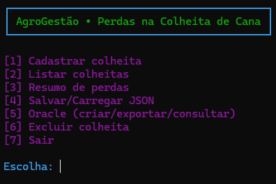
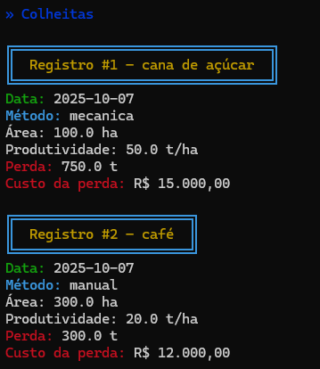
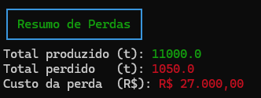
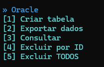

# AgroGestão • Perdas na Colheita de Cana (CLI em Python)

Projeto **100% alinhado aos capítulos 3–6** (funções, estruturas de dados, arquivos e conexão Oracle) da tarefa *Gestão do Agronegócio em Python*.

## 🎯 Objetivo (MVP)
Um app de **linha de comando** que:
1) **Cadastra colheitas** (talhão, área, produtividade, método manual/mecânica e preço por tonelada);
2) **Calcula perdas e custo da perda** (usa 5% manual e 15% mecânica, parametrizáveis);
3) **Persiste dados** em **JSON** e **gera log** em arquivo **.txt**;
4) **Sincroniza** os registros com **Oracle** (INSERT/SELECT), comprovando a conexão com banco.

> Tema escolhido: **Perdas na colheita de cana-de-açúcar** (dor real do agro).

---

## ✅ Requisitos da disciplina (Cap. 3–6) — Onde estão
- **Subalgoritmos (funções)**: `src/calculos.py`, `src/validacao.py`, `src/io_arquivos.py`, `src/db_oracle.py`, `src/app.py`  
- **Estruturas de dados**: lista/tupla/dicionário → **tabela de memória** em `app.py` (`colheitas: list[dict]`)
- **Manipulação de arquivos**: `io_arquivos.py` salva **JSON** e **log.txt**
- **Conexão com banco Oracle**: `db_oracle.py` (criação de tabela, **UPSERT com MERGE**, SELECT e exclusões)

---

## 🗂️ Estrutura
```
agro-gestao-simplificada/
├─ README.md
├─ requirements.txt
├─ .gitignore
├─ src/
│  ├─ app.py
│  ├─ calculos.py
│  ├─ validacao.py
│  ├─ io_arquivos.py
│  └─ db_oracle.py
├─ docs/
│  ├─ colheitas.png
│  ├─ menu.png
│  ├─ oracle_menu.png
│  ├─ resumo_de_perdas.png
└─ data/
   ├─ colheitas.json
   └─ log.txt

```
`data/colheitas.json` e `data/log.txt` serão criados automaticamente.

---

## ▶️ Como executar
1. **Instale dependências** (Python 3.10+):
```bash
pip install -r requirements.txt
```
2. **(Opcional) Configure Oracle** por variáveis de ambiente:
```bash
# Exemplo de DSN: hostname:1521/servicename  ou  localhost:1521/XEPDB1
set ORACLE_USER=usuario
set ORACLE_PASSWORD=senha
set ORACLE_DSN=host:1521/servicename
# macOS/Linux: export ORACLE_USER=..., etc.
```
3. **Rode o app**:
```bash
python src/app.py
```

---

## 💡 O que o app faz
- Menu CLI com as opções:
  - **1. Cadastrar colheita**
  - **2. Listar colheitas**
  - **3. Resumo de perdas (t e R$)**
  - **4. Salvar/Carregar JSON + Log**
  - **5. Exportar/Consultar no Oracle**
  - **6. Excluir colheita**
  - **7. Sair**
- **Valida entradas** (números ≥ 0, método manual/mecânica, etc.).
- **Cria a tabela Oracle** automaticamente (tratando já-existente) e permite **inserir** e **consultar**.
- Exportação para Oracle agora usa **UPSERT (MERGE)**, atualizando registros já existentes automaticamente;
- Também é possível **excluir registros individualmente ou todos de uma vez** pelo submenu Oracle.


---

## 🧪 Dica de teste rápido
1) Cadastre 3 colheitas (2 mecânicas, 1 manual) com preços diferentes;  
2) Veja o **Resumo de perdas**;  
3) Salve JSON e confira o **data/colheitas.json** e **data/log.txt**;  
4) Se tiver Oracle, teste **Exportar** e **Consultar**.

---

## 🧾 DDL Oracle (referência)
```sql
CREATE TABLE COLHEITAS (
  ID            VARCHAR2(36) PRIMARY KEY,
  DATA_COLHEITA DATE,
  TALHAO        VARCHAR2(100),
  AREA_HA       NUMBER(10,2),
  PROD_T_HA     NUMBER(10,2),
  METODO        VARCHAR2(20),
  PRECO_TON     NUMBER(10,2),
  PERDA_PCT     NUMBER(5,2),
  PERDA_TON     NUMBER(12,2),
  PERDA_REAIS   NUMBER(14,2),
  TOTAL_TON     NUMBER(14,2)
);
```
> ℹ️ Observação:  
> A exportação usa comando `MERGE` para realizar **UPSERT**, ou seja:
> - se o ID já existir, o registro é **atualizado**;  
> - se não existir, é **inserido**;  
> - elimina o erro de chave duplicada (ORA-00001).


---

---

## 🖼️ Exemplos visuais
| Tela | Descrição |
|------|------------|
|  | Menu principal (CLI colorido) |
|  | Exibição de colheitas formatada |
   | Exibição de resumo de perdas |
|  | Submenu Oracle (CRUD e sincronização) |

> As capturas reforçam a clareza visual e usabilidade do app no terminal.


---

## 📌 Observações
- Se o Oracle **não estiver acessível**, o app **segue funcional** (JSON/Log) e as funções de banco apenas informarão erro amigável;
- Este projeto foi desenhado para **clareza didática** e **conformidade integral** com a avaliação.'
- As credenciais Oracle devem ser configuradas via variáveis de ambiente e nunca commitadas;
- Recomenda-se incluir `.env` no `.gitignore` para proteger dados sensíveis.
